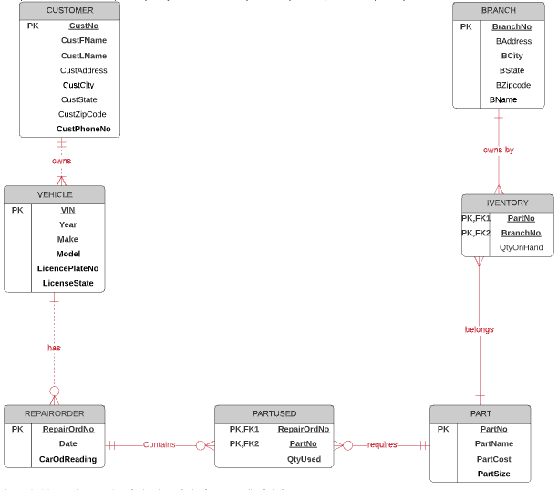
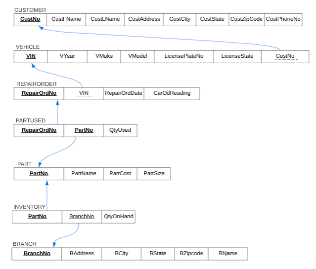

# sql_Example
## Phase 1 project
### Project Description
Design an ERD representing the database for a  car Doctor who needs it to supports its operations in its three locations in central Illinois.([see problem](https://drive.google.com/file/d/1kl1eZihiegSey0KstG249dcz5jCBj7Sm/view?usp=sharing))

#### Car Doctor ERD

 click to see ERD 

  

## Phase 2 project
### Project Description this is a continuation of Phase 1 project ([see problem](https://docs.google.com/document/d/1VlHrhxe5IUMfBgFbj4XjbYXkHjUbXr0M/edit?usp=sharing&ouid=104958678762290645389&rtpof=true&sd=true))

1. Relational Schema 

click to see the schema 

  

2. Normal Form

click to see explanation 

###### Checking for 1st normal form (1NF):

* This is a relation with no multivalued attributes and each row is unique, hence it is in 1NF .
###### Checking for 2nd normal form (2NF):

*	Even though they are bridge entities with composite keys for PARTUSED and INVENTORY however there is no Partial dependency because in these two entities the values of the non-key attributes for each entity is determine by the respective composite key , hence functional dependencies.
###### Checking for 3rd normal form (3NF):

*	There is no transitive dependency in any of the table. Since the table is in 1NF ,2NF and no transitive dependency, we conclude that the table is in 3NF. (It is also important to see that the License plate number does not identify the license state rather it will be the plate number only that is why no transitivity here.)

3. The DDL, DQL and DML For the rest of the problem

click 

  
<mark>qestion 3, 5, 6, 7</mark> refer to Phase 2 querry.sql

## Phase 3 poject
### Problem description ([see problem](https://docs.google.com/document/d/1mCiR-ve0xqJSEPiFva3_UD64ROfks3w8/edit?usp=sharing&ouid=104958678762290645389&rtpof=true&sd=true)) 

* Querry for all problems in word document in phase 3 queery.sql 

## Final Project 
### Problem description ([problem](https://docs.google.com/document/d/1e8zghsqgiJZchlbNr-VfAbmbVRYqveee/edit?usp=sharing&ouid=104958678762290645389&rtpof=true&sd=true)) 

* Querry all problems in word document in Joins Asg8.sql
